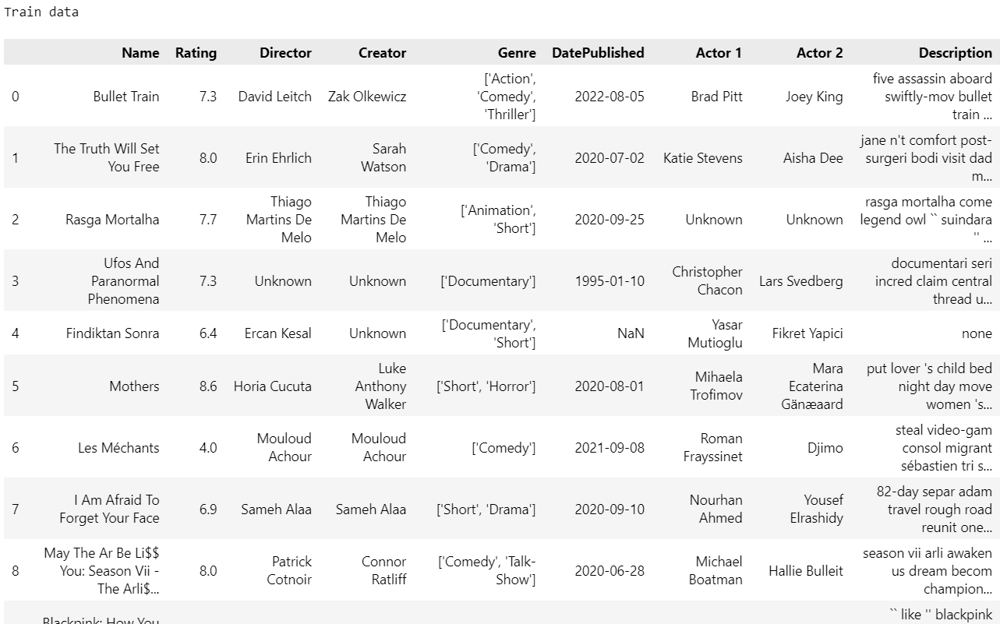
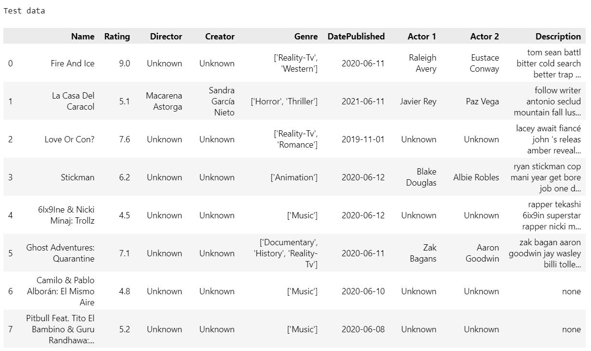
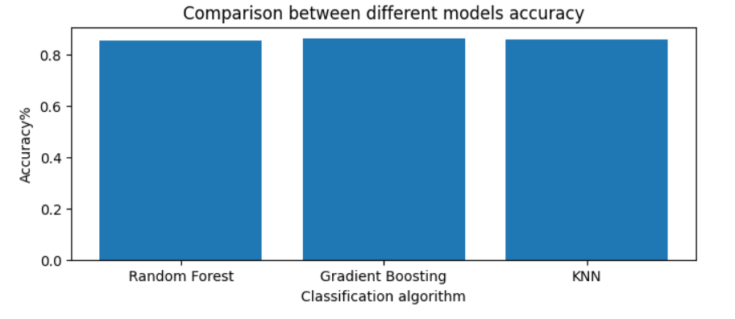

# Movie Rating Classification 

## Project Overview

The Movie Rating Classification project aims to predict movies into four categories: "Bad," "Normal," "Good," and "Excellent," based on their features such as actor, director, creator, and genre.

### IMDb Rating Scale
- **0-4**: Bad movie
- **4-6**: Normal movie
- **6-8**: Good movie
- **8-10**: Excellent movie

### Model Training and Evaluation
Once the models are trained using the training data, we evaluate their performance using the testing data. The models make predictions on the test dataset, and we assess their accuracy in classifying movies into the appropriate rating categories. This process supports the prediction of a movie's rating even before it is released.

## Features
- **Data Processing**: Cleans and preprocesses movie data.
- **Feature Engineering**: Extracts relevant features, including cast and genre, to improve classification accuracy.
- **Model Training**: Uses `scikit-learn` to train a machine learning model on the training dataset.
- **Prediction**: Evaluates the model with the test dataset to classify movies as "Bad," "Normal," "Good," or "Excellent."

## Technologies Used
- **Python**: Core programming language.
- **scikit-learn**: Library for machine learning, used for model training and evaluation.
- **pandas**: For data manipulation and analysis.
- **numpy**: For numerical computations.

## Dataset and Results
The dataset consists of various movies used for training and testing the model. Below are some sample images:

- **Training Dataset**  
  

- **Testing Dataset**  
  

- **Model Results**  
  

## Additional Information
This project contains only the components I have completed on my own. You can view the full results in the provided slide.
